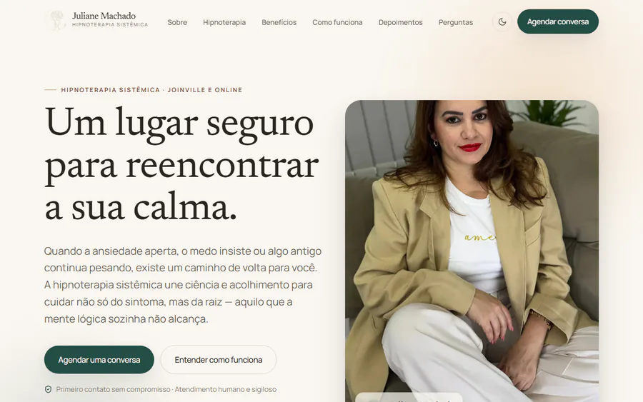
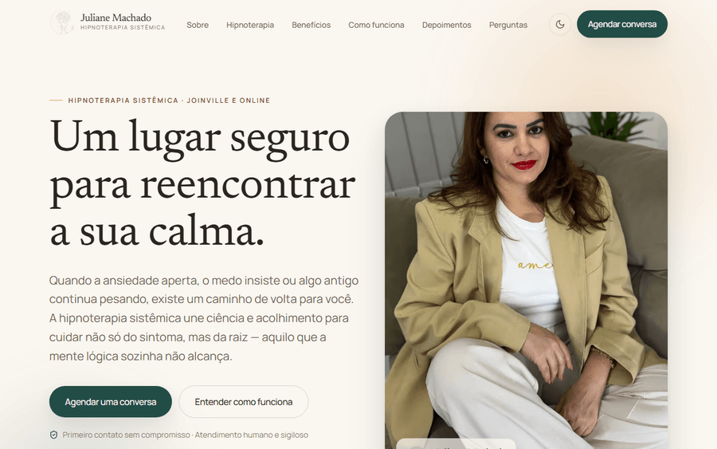
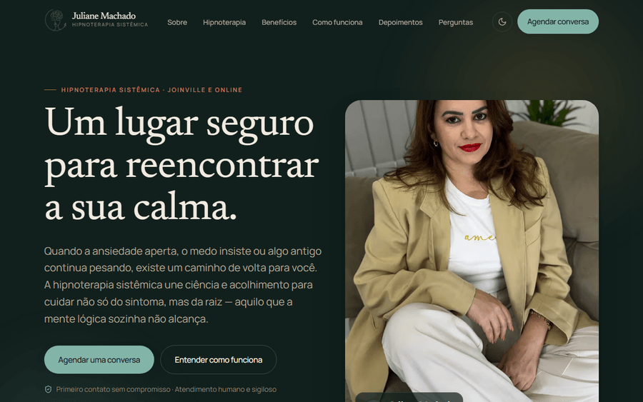
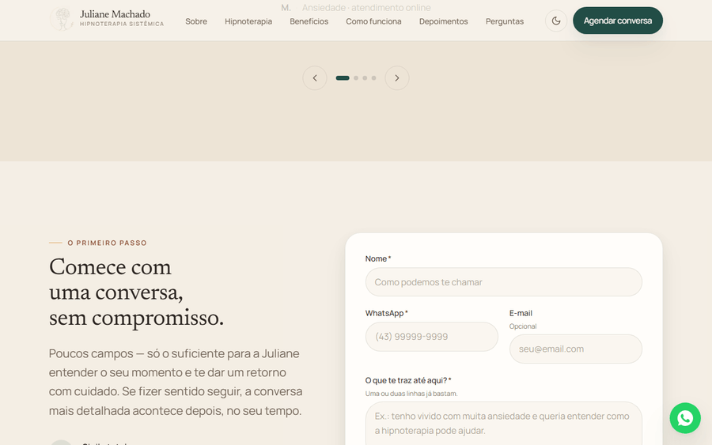
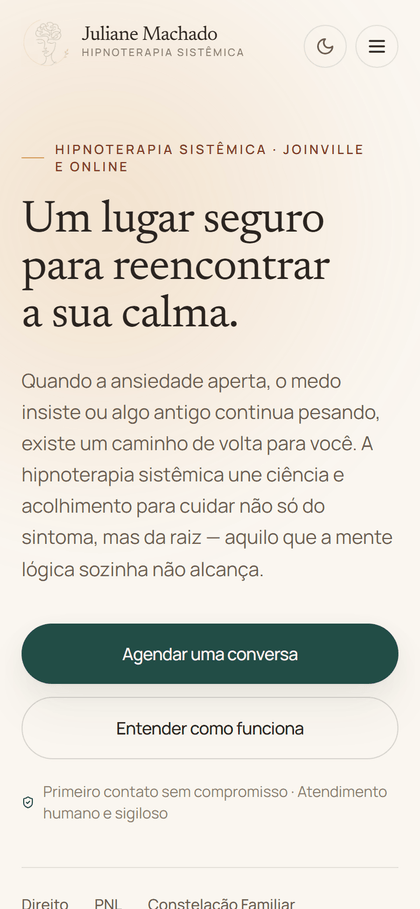

<div align="center">


# Juliane Machado · Hipnoterapia Sistêmica

**Site para consultório de hipnoterapia** — construído do design ao deploy,
com foco em acolhimento, conversão, acessibilidade e conformidade com a LGPD.

[](https://nextjs.org/)
[](https://react.dev/)
[](https://www.typescriptlang.org/)
[](https://tailwindcss.com/)
[](https://www.framer.com/motion/)
[](https://vercel.com/)

### [Ver o site ao vivo](https://jumachado.vercel.app)

</div>

---

## Navegação

<div align="center">
  
</div>

---

## Interface

| Desktop — tema claro | Desktop — tema escuro |
| :---: | :---: |
|  |  |

| Formulário de contato | Mobile |
| :---: | :---: |
|  |  |

---

## Sobre o projeto

Uma profissional de hipnoterapia precisava de presença digital que transmitisse
**segurança e credibilidade** e que transformasse visitantes em primeiros contatos.

Desenvolvi o projeto de ponta a ponta: identidade visual, logo, arquitetura de informação,
redação, implementação e publicação.

### Destaques

- **Identidade visual própria** — paleta em tons de areia, terracota e verde-pinho,
  tipografia serifada (Newsreader) com sans humanista (Manrope), tokens em CSS variables.
- **Dois momentos de captação** — decisão de produto que separa o *primeiro contato*
  (curto, baixo atrito) da *ficha de acolhimento* completa, enviada só após o agendamento.
- **Tema claro/escuro** com detecção do sistema e persistência, sem flash na primeira pintura.
- **Animações discretas** com Framer Motion, sempre respeitando `prefers-reduced-motion`.
- **Pipeline de imagens próprio** em `sharp`: recorte, gradação de cor, WebP/JPG,
  blur placeholder e manifesto tipado.

<details>
<summary><b>Decisões de produto e UX</b></summary>

<br/>

**Formulário em dois estágios.** A versão inicial pedia todos os dados clínicos logo no
primeiro contato. Do ponto de vista de conversão isso é atrito demais para quem só quer
"dar o primeiro passo". Separei em:

1. **Primeiro contato** (home) — nome, WhatsApp, uma linha sobre o que traz a pessoa e
   preferência de atendimento. O suficiente para haver retorno.
2. **Ficha de acolhimento** (`/anamnese`, `noindex`) — histórico, medicação, intensidade
   por sintoma e objetivos. Enviada após o agendamento, quando já existe vínculo — o que
   também é mais correto do ponto de vista clínico.

**Linguagem de apoio, não de tratamento.** Hipnoterapia não é profissão regulamentada no
Brasil e não trata transtornos. O conteúdo usa descrições de experiência
("tristeza ou desânimo") em vez de diagnósticos, posiciona a prática como complementar e
mantém aviso explícito de que não substitui acompanhamento médico ou psicológico.

**Rede de segurança.** Como o site fala de ansiedade e traumas, há uma linha discreta e
permanente com CVV 188 e emergência 192 junto aos formulários e no rodapé.

**Escala por sintoma.** Ao marcar múltiplas questões, cada uma recebe a própria régua de
0 a 10 — em vez de uma medida única e genérica.

</details>

<details>
<summary><b>Acessibilidade, LGPD e SEO</b></summary>

<br/>

**Acessibilidade**
- Contraste AA/AAA nas combinações de texto e fundo
- Hierarquia semântica de headings, landmarks e ARIA nos componentes interativos
- Navegação completa por teclado com foco visível e *skip link*
- `alt` descritivo em todas as imagens
- `prefers-reduced-motion` respeitado em todas as animações

**LGPD**
- Consentimento antes de qualquer cookie: analytics só carrega após aceite
- Mapa do Google com *click-to-load* (nada de terceiros no carregamento inicial)
- Fontes auto-hospedadas — nenhuma requisição a CDNs externos
- Política de Privacidade dedicada, com as bases legais e os direitos do titular

**SEO**
- Metadados completos, Open Graph e Twitter Card
- JSON-LD: `Person`, `ProfessionalService`, `WebSite` e `FAQPage`
- `sitemap.xml` e `robots.txt` gerados pela aplicação
- Páginas privadas marcadas como `noindex`

**Performance**
- Renderização estática das rotas
- Fontes locais com `next/font/local` (sem layout shift)
- Imagens em AVIF/WebP responsivas com blur placeholder
- Cache longo e imutável para assets estáticos

</details>

<details>
<summary><b>Estrutura de pastas</b></summary>

<br/>

```
app/                      # Rotas (App Router)
  layout.tsx              # Layout raiz, fontes, metadados e SEO
  page.tsx                # Home
  anamnese/               # Ficha de acolhimento (noindex)
  politica-de-privacidade/
  sitemap.ts · robots.ts · manifest.ts · icon.svg
src/
  components/
    sections/             # Hero, Sobre, Hipnoterapia, Benefícios, FAQ…
    form/                 # Formulários e campos
    layout/               # Nav, Footer, botão flutuante
    ui/                   # Button, Section, Reveal, SmartImage…
    seo/ · consent/ · theme/ · brand/
  content/                # Todo o conteúdo textual, tipado
  lib/                    # Configuração, imagens, envios, schemas
  styles/globals.css      # Design tokens e base
public/images · public/fonts
scripts/process-images.mjs
```

</details>

---

## Stack

| Camada | Tecnologia |
| --- | --- |
| Framework | Next.js 15 (App Router) · React 19 |
| Linguagem | TypeScript (strict) |
| Estilo | Tailwind CSS v4 + design tokens em CSS variables |
| Animação | Framer Motion |
| Formulários | React Hook Form + Zod |
| Ícones | Lucide |
| Imagens | sharp + `next/image` |
| Deploy | Vercel |


## Licença

Repositório publicado como portfólio. O **código** é de autoria de Ana Carolina
Ribeiro Miranda; a **identidade visual, as fotografias e os textos** pertencem a
Juliane Machado e não são licenciados para reuso.
Consulte o arquivo [LICENSE](LICENSE) antes de qualquer utilização.


## Autoria

Projeto concebido e desenvolvido por mim **Ana Carolina Ribeiro Miranda**
Engenheira da Computação

[](https://www.linkedin.com/in/anac-miranda)
[](https://github.com/AnaaMiranda)
